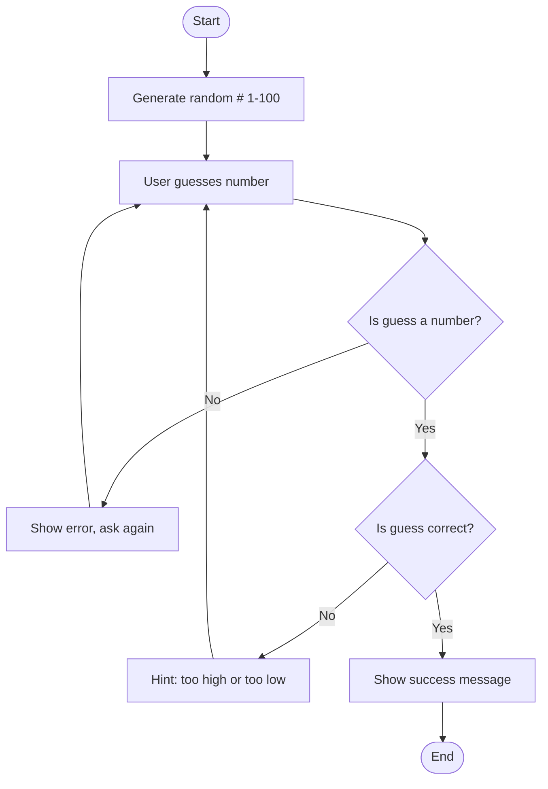

# Random Guessing Game Flowchart

1. **Start**: The game begins.
2. **Generate random number 1-100**: The computer randomly selects a number for the user to guess.
3. **User guesses number**: The program prompts the user to enter their guess.
4. **Is guess a number**?: The program checks if the user input is a valid number.
5. **Show error, ask again**: If the input is not a number, display an error message and ask for another guess.
6. **Is guess correct**?: If the input is valid, check whether the guess matches the generated number.
7. **Show hint: too high or too low**: If the guess is incorrect, tell the user whether their guess was too high or too low, then ask for another guess.
8. **Show success message**: If the guess is correct, congratulate the user.
9. **End**: The game ends.
